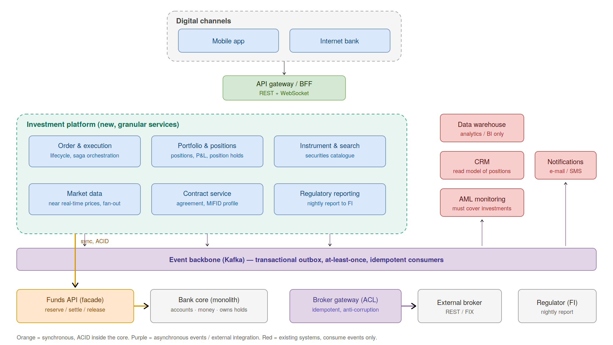
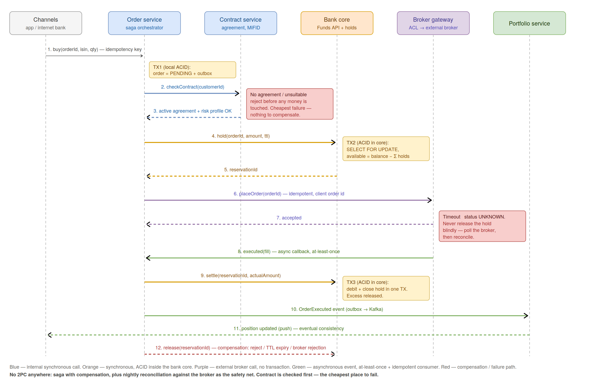
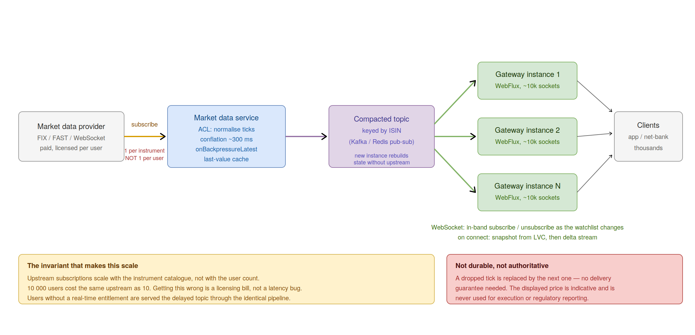

# Coop investeerimisplatvormi arhitektuur

See dokument koondab investeerimisteenuse TO-BE arhitektuuri, integratsioonimustrid,
tehnoloogilised valikud, ACID-piirid, vabade vahendite kontrolli, aruandluse, hinnavoo,
valuutapõhise tootluse, puuduvad nõuded ja eeldused.

## Sisukord

1. [Loogiline TO-BE vaade](#1-loogiline-to-be-vaade)
2. [Integratsioonimustrid](#2-integratsioonimustrid)
3. [Tehnoloogiapinu](#3-tehnoloogiapinu)
4. [Investeerimisteenuse lepingu hoidmine](#4-investeerimisteenuse-lepingu-hoidmine)
5. [ACID-piirid granulaarses teenusemaastikus](#5-acid-piirid-granulaarses-teenusemaastikus)
6. [Vabade vahendite kontroll enne väärtpaberi ostu](#6-vabade-vahendite-kontroll-enne-väärtpaberi-ostu)
7. [Aruandlus](#7-aruandlus)
8. [Peaaegu reaalajas hinnad](#8-peaaegu-reaalajas-hinnad)
9. [USD-positsiooni tootlus eurodes](#9-usd-positsiooni-tootlus-eurodes)
10. [Olulised teemad, mida ülesanne ei maini](#10-olulised-teemad-mida-ülesanne-ei-maini)
11. [Eeldused](#11-eeldused)

## 1. Loogiline TO-BE vaade



Lahenduse keskne mõte on hoida raha puudutavad invariandid seal, kus raha tegelikult elab:
pangatuumas. Investeerimisplatvorm laiendab tuuma minimaalselt, kuid ei dubleeri selle
rahaloogikat. Iga uus teenus omab enda andmeid ja on nende ainus kirjutaja. Skeeme ei jagata,
teiste teenuste andmebaase ei loeta otse ning integratsioon toimub lepingute ja sündmuste kaudu.

Sünkroonset suhtlust kasutatakse ainult seal, kus on vaja autoriteetset vastust: lepingu kontroll,
vabade vahendite reserveerimine ja orderi saatmine maaklerile. Kõik, mis toimub pärast täidetud
tehingut, liigub sündmustena.

Teenuste granulaarsus tähendab siin piire ja omandit, mitte tingimata seda, et esimeses release'is
peab olema üheksa eraldi konteinerit. Osa loogilisi teenuseid võib alguses elada moodulitena ning
liikuda hiljem eraldi deployable'iks, kui neil on oma meeskond ja erinev skaleerumisprofiil.

### 1.1 Uued komponendid

| Komponent | Vastutus | Omab andmeid | Miks eraldi |
|---|---|---|---|
| API gateway / BFF | Üks sisenemispunkt mobiili- ja internetipangale; tokeni kontroll, rate limiting, ekraanipõhine koondamine, WebSocket endpoint | ei | varjab sisemist teenusemaastikku klientide eest |
| Order & Execution | Orderi elutsükkel, ostu/müügi saga, orkestreerimine ja kompensatsioonid | orderid, saga olek, outbox | kõrge muutumissagedus; ainus koht, mis kompenseerib |
| Portfolio & Positions | Positsioonid, lotid, soetusmaksumus, positsiooni hold'id, väärtustamine | positsioonid, lotid, EOD väärtustused | lugemiskoormus ja väärtustamise omand erinevad orderitest |
| Instrument & Search | Väärtpaberite kataloog, otsing, referentsandmed | instrumendid, otsinguindeks | valdavalt read-only andmed, erinev cache ja indeks |
| Market Data | Üks upstream subscription, normaliseerimine, conflation, last-value cache, fan-out; FX moodulina | püsivat ärilist andmestikku ei oma | skaleerub ühenduste, mitte tehingute järgi |
| Contract Service | Investeerimislepingu, MiFID profiili ja õiguste elutsükkel | lepingud, hindamised, tõendite viited | eraldi bounded context; pangatuumal puudub MiFID sõnavara |
| Regulatory Reporting | Öine FI aruanne, gap detection, versioonitud esitused | muutumatud tehingukirjed, aruande artefaktid | juriidiline vastutus ja pikaajaline säilitamine |
| Broker Gateway / ACL | Maakleri anti-corruption layer, idempotentsed käsud, callback'id, polling fallback, circuit breaker | broker order id mapping | maakleri protokoll ja sõnavara lõpevad siin |
| Funds API | `reserve`, `settle`, `release` pangatuuma vastu; idempotentsus, TTL, retry'd | ei, delegeerib tuuma | strangler fig piir, mille kaudu tuuma hiljem lõigata |

### 1.2 Mis jääb pangatuuma

Pangatuum jääb autoriteediks kliendi identiteedi, KYC, kontode, saldode, maksete ja raha hold'ide
osas. Eriti oluline on hold:

```text
available_balance = balance - sum(active holds)
```

Kui maksete moodul hold'i ei näe, siis see ei ole päris reserveering. Seetõttu on Funds API küll
uus fassaad, kuid raha invariant ise jääb pangatuuma transaktsiooni.

### 1.3 Olemasolevate süsteemide uus roll

Data warehouse ei impordi investeerimisandmeid otse tuumast, vaid tarbib sündmusi. AML saab lisaks
maksetele ka investeerimissündmused, näiteks `OrderExecuted` ja `PositionChanged`. CRM ehitab
sündmustest read-only projektsiooni ning detailide jaoks küsib Portfolio ja Contract teenustelt.
Teavitused muutuvad samuti sündmuste tarbijaks: Order teenus ei saada e-kirju, vaid avaldab fakti.

### 1.4 Teadlikult loomata jäetud teenused

FX ei ole alguses eraldi teenus, vaid Market Data moodul, sest upstream, cache ja conflation on
sarnased. Väärtustamisteenust ei eraldata, sest väärtustamine vajab soetusmaksumust, mida omab
Portfolio. Klienditeenust ei dubleerita, sest identiteedi omanik on pangatuum. Uut notification
teenust ei looda, kui selline moodul on pangas juba olemas.

### 1.5 Peamised andmevood



Ostuvoog liigub kanalist Order teenusesse, kontrollib lepingu Contract teenuses, reserveerib raha
tuumas, saadab orderi Broker Gateway kaudu maaklerile ja ootab täitmist. Täitmise järel tehakse
settlement tuumas, avaldatakse `OrderExecuted` outbox'i kaudu ning Portfolio, CRM, AML, DWH,
Notifications ja Reporting tarbivad sündmust sõltumatult.

Müügivoog on peegelpilt, kuid napp ressurss on väärtpaberipositsioon, mitte raha. Portfolio peab
reserveerima positsiooni, et sama kogust ei müüdaks kahest kanalist kaks korda.

Lepingu allkirjastamisel kirjutab Contract teenus lepingu ja avaldab `ContractActivated`. Projections
on ainult kuvamiseks; orderi eelkontroll küsib alati andmete omanikult.

Hinnad liiguvad ühest upstream subscription'ist Market Data teenusesse, sealt kompaktsesse topic'usse
või cache'i ning gateway kaudu WebSocketiga klientidele.



Öine regulatiivne aruanne luuakse Reporting teenuse enda muutumatust andmehoidlast pärast
reconciliation'it maakleri andmetega.

## 2. Integratsioonimustrid

Integratsioonimuster ei ole nimekiri tehnoloogiatest, vaid otsus piiril. Igal piiril on erinev
omanik, latentsusvajadus ja rikete profiil.

| Piir | Stiil | Muster | Tagasilükatud alternatiiv |
|---|---|---|---|
| Kanalid -> platvorm | sünkroonne | API gateway / BFF, REST + WebSocket | kanalid kutsuvad teenuseid otse |
| Platvorm -> pangatuum | sünkroonne | Funds API fassaad, idempotentsed käsud, strangler fig | shared DB, otsepäringud, 2PC |
| Platvorm -> maakler | sünkroonne käsk + asünkroonne callback | anti-corruption layer, idempotency key, circuit breaker | maakleri mudel lekib domeeni |
| Order -> Contract | sünkroonne | autoriteetne lugemine omanikult | replikeeritud projektsiooni lugemine |
| Platvormi sees | asünkroonne | transactional outbox -> Kafka, idempotentsed tarbijad | dual write, sünkroonsed call chain'id |
| Order saga | asünkroonne, orkestreeritud | saga kompensatsiooniga | 2PC või puhas choreography |
| DWH / CRM / AML / Notifications | asünkroonne | publish-subscribe, event-carried state transfer | point-to-point ETL elusast DB-st |
| Market data -> kanalid | streaming | fan-out, conflation, snapshot + delta | polling või üks upstream user'i kohta |
| Platvorm -> regulaator | batch | öine fail/API, versioonitud esitused | streaming regulaatorile |

### 2.1 Kanalid ja BFF

Mobiili- ja internetipank räägivad ühe sissepääsuga. Gateway valideerib OAuth2 tokeni, rakendab
rate limiting'ut ning koondab portfelli ekraanile vajalikud päringud. Kui klient teaks sisemisi
teenuseid, muutuks iga teenuse jagamine mobiiliäppide release'iks.

### 2.2 Pangatuum ja Funds API

Funds API pakub `reserve`, `settle` ja `release` käske. Käsud on idempotentsed ja võtmega `orderId`.
Platvorm ei loe pangatuuma tabeleid ega kasuta 2PC-d. Fassaad tõlgib ja kaitseb, kuid raha invariant
jääb tuuma transaktsiooni.

### 2.3 Maakleri anti-corruption layer

Broker Gateway tõlgib maakleri protokolli meie domeenikeelde. Käsk läheb välja sünkroonselt ja
kannab meie `orderId` väärtust client order id-na. Täitmine tuleb tagasi asünkroonselt ning seetõttu
peavad tarbijad olema idempotentsed. Timeout'i järel peab olema polling fallback, sest me ei tea, kas
maakler orderi vastu võttis.

Circuit breaker, timeout, retry koos jitter'iga ja bulkhead kuuluvad just sellele piirile, sest
kolmas osapool on süsteemi kõige tõenäolisem rikkeallikas.

### 2.4 Platvormi sisemine suhtlus

Teenused avaldavad fakte sündmustena. Sündmus kirjutatakse samas DB transaktsioonis, kus muutus ka
olek: see on transactional outbox. Seejärel viib publisher või Debezium sündmuse Kafka'sse.

`OrderExecuted` on event-carried state transfer: sündmus sisaldab kõike, mida Portfolio, CRM, AML,
DWH ja Reporting vajavad. Muidu tekiks viis callback'i Order teenusesse ning asünkroonsest
arhitektuurist saaks varjatud sünkroonne sõltuvus.

Order flow on orkestreeritud saga, sest puudutab raha ja kompensatsioone. Fan-out pärast täitmist on
choreography, sest Order teenus ei pea teadma, kes sündmust tarbib.

### 2.5 Regulaator ja olemasolevad süsteemid

Regulatiivne aruanne on batch, mitte stream. Aruanne on artefakt, millel on olek, hash, versioon ja
parandused. DWH jääb analüütikaks, kuid investeerimisandmeid saab sündmuste kaudu.

## 3. Tehnoloogiapinu

### 3.1 Keel ja runtime

Põhivalik on Java 21 LTS. Records ja sealed interfaces sobivad domeeni väärtusobjektidele ning
orderi olekumudelile, kus kompilaator peab aitama katmata olekuid avastada. Virtual threads lubavad
tavalistel teenustel jääda blocking Spring MVC peale ilma thread-per-request kuluta. Pank peab seda
süsteemi jooksutama aastaid, seega LTS on teadlik valik.

### 3.2 Framework

Spring Boot 3.5+ / 4.x, Spring Framework, Spring Data JPA ja Spring Security annavad transaktsioonid,
OAuth2 resource server'i, Actuator'i, metrics'id, Testcontainers toe ja migratsioonimudeli, mida
panga operatsioon tunneb.

Spring Modulith sobib esimeseks etapiks: loogilised piirid on olemas ja build kontrollib neid, kuid
kõik moodulid ei pea kohe olema eraldi deployable'id.

### 3.3 Blocking ja reactive

Order, Portfolio ja Contract jäävad blocking Spring MVC teenusteks, sest nende pudelikael on DB.
Market Data gateway on WebFlux/Reactor Netty, sest see hoiab tuhandeid peamiselt idle WebSocket
ühendusi ja vajab backpressure'i ning conflation'it.

Virtual threads ei asenda Reactor'it hinnavoos: odavad thread'id ja piiritletud stream on erinevad
probleemid.

### 3.4 Püsikiht

PostgreSQL, üks andmebaas teenuse kohta, Flyway migratsioonideks. Kõvad invariandid on DB
constraint'id: unikaalsed idempotency key'd, `CHECK`, välisvõtmed, `SELECT FOR UPDATE`.

Raha on DB-s `NUMERIC(19,4)` ja Java-s `BigDecimal`. Mitte `double`, mitte `float`, ka JSON-is mitte.

### 3.5 Event backbone

Kafka koos Avro või Protobuf skeemidega ja schema registry'ga. Kafka on siin parem kui RabbitMQ,
sest vaja on logi semantikat: mitu tarbijat, replay, compaction, offset'id ja pikk lepingu eluiga.

Outbox avaldatakse CDC-ga või polling publisher'iga. Otse rakenduskoodist Kafka'sse kirjutamine sama
ärilise muutuse kõrval looks dual-write vea.

### 3.6 Maakler, cache, turve ja jälgitavus

Maakleri protokoll on Broker Gateway sees: QuickFIX/J FIX jaoks või `RestClient` REST jaoks.
Resilience4j annab circuit breaker'i, retry, timeout'i ja bulkhead'i.

Caffeine sobib last-value cache'iks; Redis ainult siis, kui jagatud cache on tegelikult vajalik.
ShedLock peab kaitsma scheduled job'e, mida klastris tohib joosta ainult üks eksemplar.

Gateway kasutab OAuth2/OIDC-d panga IAM-i vastu, teenuste vahel on mTLS ning iga raha liigutav käsk
on auditeeritav. Observability põhineb OpenTelemetry trace'idel, Micrometer metrics'itel ja
struktureeritud logidel, kus `orderId` ja `traceId` liiguvad ka sündmuste päistes.

### 3.7 Testimine ja delivery

Integratsioonitestid kasutavad Testcontainers'it päris PostgreSQL-i ja Kafka jaoks. H2 ei korda
`SELECT FOR UPDATE` ja unikaalsete constraint'ide käitumist. Piiridel on consumer-driven contract
testid ning maakleri rikete jaoks WireMock.

Delivery on Docker, Kubernetes, Gradle ja panga CI. Serverless ei sobi pika elueaga WebSocketite ja
olekulise saga orkestreerimise tõttu.

## 4. Investeerimisteenuse lepingu hoidmine

Investeerimisleping ei ole sama objekt kui arvelduskonto või laenuleping. See kannab MiFID II
andmeid: kliendi kategooria, sobivuse ja asjakohasuse hinnangud, riskiprofiil, teadmised ja
kogemus, target market, maksuresidentsus, W-8BEN USA väärtpaberite jaoks, turuandmete õigused ning
tingimuste aktsepteeritud versioon.

Need andmed ei kuulu maksete domeeni. Kui need panna pangatuuma, reostatakse tuuma andmemudel võõra
domeeniga või jagatakse sama leping kahe süsteemi vahel.

### 4.1 Otsus

Investeerimislepingu master on investeerimisplatvormi Contract Service. Pangatuum jääb master'iks
kliendi identiteedile, KYC-le, kontodele ja rahale. Contract Service hoiab `customerId` viidet ja
investeerimisdomeeni atribuute, mitte ei dubleeri kliendi master-andmeid.

| Andmed | Master | Teised |
|---|---|---|
| Kliendi identiteet ja KYC | Pangatuum | read-only |
| Kontod ja saldod | Pangatuum | read-only |
| Investeerimisleping ja MiFID profiil | Contract Service | read-only |
| Allkirjastatud dokument | Dokumendihoidla / panga DMS | viide + hash Contract Service'is |

### 4.2 Üks kliendivaade sündmuste kaudu

Contract Service avaldab lepingu aktiveerimisel `ContractActivated { customerId, contractId, type,
version, activatedAt }`. Pangatuum, CRM ja DWH ehitavad sellest read-only projektsiooni.

Master-andmeid ei dubleerita; avaldatakse fakte. Kui klienditeenindaja vajab detaili, küsib CRM
Contract Service'ilt, mitte ei hoia MiFID detailide koopiat.

### 4.3 Autoriteetne kontroll on sünkroonne

Order teenus ei tohi teha tehingut ilma kehtiva lepinguta. Seetõttu küsib orderi eelkontroll
Contract Service'ilt otse ja sünkroonselt. Projektsioonid sobivad kuvamiseks, mitte autoriteetseks
otsuseks.

### 4.4 Leping on elutsükkel

| Olek | Ost | Müük / positsiooni sulgemine |
|---|---|---|
| `DRAFT` | ei | ei |
| `ACTIVE` | jah | jah |
| `SUSPENDED` | ei | jah |
| `TERMINATED` | ei | jah, kuni portfell on tühi |

Viimane asümmeetria on oluline: lõpetatud lepinguga klient peab saama olemasolevad varad maha müüa,
sest kliendi vara lõksu panemine on regulatiivne probleem.

Tingimused on versioonitud. Uue versiooni korral jätkab klient varem aktsepteeritud versiooni alusel
kuni järgmise orderini või kuni ärireegel nõuab uut aktsepteerimist.

### 4.5 Allkiri ja tõendid

Eestis allkirjastatakse leping eIDAS kvalifitseeritud e-allkirjaga, näiteks Smart-ID või Mobile-ID
kaudu. Allkirjastatud konteiner on panga dokumendihoidlas, Contract Service hoiab viidet, hash'i ja
tõendite rada: kanal, aeg, tingimuste versioon, IP ja seade. MiFID II säilitamine on vähemalt viis
aastat pärast suhte lõppu, regulaatori nõudel kuni seitse.

## 5. ACID-piirid granulaarses teenusemaastikus

ACID ei kao, vaid kahaneb. Monoliidis kattub transaktsioonipiir ärilise operatsiooniga. Teenusteks
jagatuna on igal teenusel lokaalne ACID transaktsioon oma DB vastu, kuid teenuste vahel transaktsiooni
ei ole.

Disainireegel:

1. otsusta, millised invariandid vajavad tugevat konsistentsust;
2. pane need ühe teenuse ja ühe andmebaasi sisse;
3. ühenda ülejäänu saga, sündmuste, reconciliation'i ja idempotentsusega.

### 5.1 Katkevad ahelad

Ostu kriitiline ahel:

```text
order created -> contract checked -> funds reserved -> order sent to broker
              -> execution reported -> settlement -> position updated -> notification
```

Olulised rikete kohad:

| Vahe | Mis võib juhtuda | Leevendus |
|---|---|---|
| Pärast orderi loomist, enne reserveerimist | Order jääb `PENDING` | TTL ja saga recovery |
| Pärast reserveeringut, enne maaklerit | Raha külmunud, orderit pole | hold TTL ja kompenseeriv `release` |
| Maakleri timeout | Ei tea, kas order eksisteerib | `UNKNOWN`, polling, mitte kunagi pime release |
| Pärast täitmist, enne settlement'i | Tehing eksisteerib, raha pole liikunud | idempotentne `settle` retry |
| Pärast settlement'i, enne positsiooni uuendust | Raha läinud, positsioon pole nähtav | outbox tagab sündmuse kohaletoimetamise |

Müügi puhul on napp ressurss positsioon. Portfolio peab hoidma position hold'e sama semantikaga:
reserve, settle, release, idempotency key ja TTL.

Lepingu allkirjastamine võib olla eventual consistency, kuid orderi eelkontroll ei tohi lugeda
projektsiooni. Aruandlus vajab pigem täielikkust kui tugevat konsistentsust. Hinnavoog ei vaja ACID
garantiid ega püsivust.

### 5.2 Miks mitte 2PC / XA

2PC üle pangatuuma, Order teenuse ja välise maakleri ei ole realistlik. Maakler ei liitu meie
transaction manager'iga, XA hoiaks tuuma lukke välise võrgukutse ajal ning coordinator muutuks
single point of failure'iks. Tehing ei ole DB mõttes atomaarne; see tehakse äriliselt atomaarseks
sagaga.

### 5.3 Saga, outbox, idempotentsus

Order teenus orkestreerib saga olekumudelit:

```text
PENDING -> CONTRACT_OK -> RESERVED -> SENT -> UNKNOWN? -> EXECUTED -> SETTLED / CANCELLED
```

Kompensatsioon ei ole rollback, vaid uus äriline fakt, näiteks hold'i vabastamine.

Transactional outbox lahendab dual-write vea: olekumuutus ja sündmus kirjutatakse samas
transaktsioonis samasse DB-sse, eraldi publisher viib sündmuse Kafka'sse.

At-least-once delivery nõuab idempotentseid tarbijaid. Eelistatud on loomulikult idempotentne
operatsioon, näiteks `setQuantity`, kuid delta korral on vaja dedup tabelit ja unikaalset constraint'i
`event_id` või `(consumer, event_id)` peale. Andmebaasi constraint on garantii; rakenduse `if` on
optimeering.

### 5.4 Kasutajale nähtav konsistents

Kasutaja peab nägema pending olekut, mitte ootama, kuni kõik projektsioonid jõuavad järgi. Order
teenus on orderi oleku allikas; Portfolio on arveldatud positsiooni allikas. Kahel teenusel ei tohi
olla õigust vastata samale autoriteetsele küsimusele.

## 6. Vabade vahendite kontroll enne väärtpaberi ostu

Lihtne saldokontroll on time-of-check to time-of-use race. Kui pärast kontrolli, kuid enne
settlement'i tehakse makse või teine investeerimisorder, võib maakleris täidetud tehingul puududa
raha. Pank on siis riskis.

Kaks tingimust on vältimatud:

1. raha peab muutuma kättesaamatuks kontrolli hetkel;
2. kõik raha liigutavad osapooled peavad seda nägema.

### 6.1 Reserveering ehk hold

Kasutatakse kontopõhist hold'i:

```text
available_balance = balance - sum(active holds)
```

Voog:

| Samm | Tegevus | Konsistents |
|---|---|---|
| 1 | Kanal saadab `buy(orderId)` | `orderId` on idempotency key |
| 2 | Order küsib tuumalt `hold(orderId, amount, ttl)` | ACID tuumas |
| 3 | Tuum tagastab `reservationId`; order -> `RESERVED` | lokaalne ACID |
| 4 | Broker Gateway saadab orderi maaklerile | transaktsiooni pole |
| 5 | Maakler kinnitab ja saadab hiljem täitmise | at-least-once |
| 6 | Order küsib tuumalt `settle(reservationId, actualAmount)` | ACID tuumas |
| 7 | `OrderExecuted` -> Portfolio ja kanalid | eventual |
| 8 | Reject / expiry / timeout korral `release(reservationId)` | ACID tuumas |

Reserveeritud summa sisaldab hinna libisemise, FX liikumise ja tasude puhvrit. Lõplik settlement
kasutab tegelikku täitmissummat ning vahe vabastatakse.

### 6.2 Kus hold elab

Valik A on hold pangatuumas. Pluss: üks raha tõde ja üks transaktsioon. Miinus: monoliiti tuleb
muuta.

Valik B on eraldi Wallet/Reservation teenus. See on puhtam, kuid fataalne, kui pangatuum sellest ei
tea. Hold, mida maksete moodul ei näe, ei ole hold.

Valitud lahendus on hübriid: praegu hold pangatuumas ja selle ees uus Funds API. Hiljem võib
kliendi investeerimisraha liikuda eraldi investment cash account'i või Wallet teenusesse.

### 6.3 Atomaarne hold

DB tasemel on vaja `account_hold` tabelit, unikaalset `order_id` idempotentsuse jaoks, staatuseid
`ACTIVE`, `SETTLED`, `RELEASED`, `expires_at` ja positiivse summa constraint'i. Debit path lukustab
konto rea `SELECT ... FOR UPDATE` abil ja arvutab kättesaadava saldo samas transaktsioonis.

Pessimistlik lukk on siin parem kui optimistic locking, sest ühe konto contention on madal, kuid
kaotatud update oleks finantskahju.

### 6.4 Maakleri timeout

Kui `placeOrder` timeout'ib, ei tea me, kas maakler võttis orderi vastu. Hold'i pime vabastamine on
ohtlik, sest order võib veel täituda. Igavene hold on samuti vale. Order läheb olekusse `UNKNOWN`,
reconciliation worker küsib maaklerilt `GET /orders/{orderId}` ning tegeliku oleku põhjal teeb
settlement'i või release'i. TTL on tagavara ja alarmi alus, mitte peamine mehhanism.

## 7. Aruandlus

Ülesanne segab kaks aruannet, mida tuleb eristada:

1. regulatiivne öine klienditehingute aruanne FI-le;
2. analüütiline ja äriline aruandlus DWH-s.

Vastus on mõlemad, kuid eri kohtades.

### 7.1 Regulatiivne aruanne kuulub platvormi

FI aruandlus on investeerimisplatvormi Regulatory Reporting teenuse vastutus. Sellel on oma
andmehoidla, sest oluline on vastutus, tähtaeg, täielikkus, taastoodetavus, paranduste elutsükkel ja
säilitamine.

DWH on BI jaoks. Kui ETL hilineb või analüütika skeem muutub, ei tohi selle tõttu jääda
regulatiivne aruanne esitamata.

Reporting teenus tarbib `OrderExecuted` ja `TradeSettled` sündmusi ning kirjutab muutumatud
tehingukirjed. Ta peab tuvastama sequence gap'e, mitte ainult töötlema seda, mis kohale jõudis.

Cutoff on tehingu ajatempel, mitte ingest ajatempel. 23:59:58 tehtud ja 00:00:03 tarbitud tehing
kuulub eelmisesse aruandepäeva.

Enne esitamist võrreldakse andmeid maakleri statement'idega. Erinevus blokeerib esitamise ja tõstab
alarmi. Hilised täitmised ja parandused on uued esitused, mitte vana aruande üle kirjutamine.

### 7.2 DWH roll

DWH jääb analüütikaks: toote müük, kliendisegmendid, portfelli keskmised, juhtimisaruanded. Erinevus
on integratsioonis: investeerimisandmeid ei impordita tuuma tabelitest, vaid tarbitakse event
backbone'ist.

Põhireegel: juriidiliselt kohustuslik aruandlus on toote funktsioon ja elab tootega; aruandlus, mida
pank tahab enda mõistmiseks, elab warehouse'is.

## 8. Peaaegu reaalajas hinnad

Õige probleem ei ole "meil on vaja WebSocketit", vaid fan-out ratio. Tuhanded kasutajad vaatavad
väikest arvu instrumente. Süsteem peab hoidma ühe upstream subscription'i instrumendi kohta, mitte
kasutaja kohta.

### 8.1 Upstream ja õigused

Hinnapakkuja, maakler, Nasdaq Nordic, Refinitiv või Bloomberg saadab tick'e subscription stream'ina:
FIX/FAST, WebSocket või multicast. Polling välise API vastu on halb latentsuse, hinna ja rate limit'i
tõttu.

Reaalajas turuandmed on litsentsitud kasutaja ja entitlement taseme järgi. Market Data teenus peab
eristama real-time ja delayed feed'i algusest peale.

### 8.2 Sisemine jaotus

```text
provider -> Market Data service -> last-value cache + Kafka/Redis -> gateway instances -> clients
```

Market Data teenus on ainus upstream klient ja normaliseerib tick'id meie mudelisse. Kafka kompaktne
topic ISIN võtmega lubab uuel gateway'l taastada viimase hinna ilma upstream'i puudutamata. Gateway
instantsid hoiavad kliendiühendusi ja fan-out'ivad.

Hinnad ei ole püsivad ärilised andmed. Kadunud tick asendub järgmisega.

### 8.3 Conflation

Likviidne instrument võib anda sadu tick'e sekundis, kuid kasutaja ekraan vajab umbes 250-500 ms
värskendust. Iga tick'i saatmine igale kliendile on raiskamine ja tekitab aeglastel ühendustel
stale backlog'i.

Lahendus on hoida iga instrumendi viimane väärtus ja saata snapshot fikseeritud cadence'iga.
`onBackpressureLatest()` tähendab, et aeglane tarbija kaotab vahepealsed hinnad, mitte ei peata
stream'i ega täida mälu. Hinnavoos on see õige käitumine.

### 8.4 Transport

Valik on WebSocket, sest subscription'id muutuvad dünaamiliselt: watchlist, instrumendi leht, tab'i
vahetus. Sama ühendus võib kanda ka orderi oleku muutuseid.

SSE oleks kaitstav, kui push oleks ainult ühesuunaline ja subscription'id staatilised. Polling ei
ole siin kaitstav.

WebSocket gateway kasutab WebFlux/Reactor Netty't. Business teenused jäävad blocking MVC peale.

### 8.5 Snapshot + delta ja skaleerimine

Ühenduse loomisel saab klient kohe snapshot'i last-value cache'ist ja seejärel delta stream'i. Sama
kehtib reconnect'i korral, mis on mobiilis normaalne.

Gateway on ärilise oleku suhtes stateless; socket'i subscription state on ühenduse küljes ja seetõttu
ühenduse eluea jooksul ühe instantsi külge seotud. Uus gateway instants lisab ühe sisemise topic'u
consumer'i, upstream jääb samaks.

Olulised metrics'id on avatud ühendused, ticks/s sisse ja välja, conflation ratio, dropped ticks ja
time-since-last-tick instrumendi kohta.

Kuvatav hind on indikatiivne. Täitmishind tuleb ainult maakleri execution report'ist ja
regulatiivne aruanne kasutab täitmishinda, mitte ekraanihinda.

## 9. USD-positsiooni tootlus eurodes

Küsimus sisaldab kolme küsimust:

1. mis on positsiooni praegune väärtus;
2. mis oli selle soetusmaksumus;
3. mis valuutas tootlust mõõdetakse ning kui suur osa tuleb instrumendist ja kui suur FX-ist.

Hinnavoog vastab ainult esimesele küsimusele.

### 9.1 EUR tootlus ei ole USD tootlus

Näide:

| | Ostul | Täna |
|---|---|---|
| Hind | $150.00 | $165.00 |
| Kogus | 100 | 100 |
| Väärtus USD | $15 000 | $16 500 |
| EUR/USD | 1.10 | 1.20 |
| Väärtus EUR | EUR 13 636.36 | EUR 13 750.00 |

USD-s on klient plussis 10%. EUR-is on tootlus umbes 0.83%. Aktsia tõusis, dollar langes ja eurodes
jäi tootlus peaaegu alles hoidmata. Seetõttu tuleb kuvada nii instrumendi valuuta tootlus kui ka
kliendi aruandlusvaluuta tootlus.

### 9.2 Ajalugu ei hinnastata ümber

Tehingu FX kurss salvestatakse tehingu hetkel ja seda ei arvutata hiljem ümber. Kui soetusmaksumus
oleks ainult USD-s ja iga aruanne teisendaks selle tänase kursiga, muutuks vana väljavõte iga kuu.

Tehingukirje hoiab muutumatult: täitmishind, kogus, valuuta, tasud, rakendatud FX kurss, allikas,
ajatempel ning settlement summa nii instrumendi valuutas kui konto valuutas.

### 9.3 Numbrite allikad

| Number | Allikas | Püsiv? | Autoriteetne? |
|---|---|---|---|
| Soetusmaksumus EUR ja USD | Portfolio, kirjutatud täitmisel | jah | jah |
| Realiseeritud P&L | tuletatud arveldatud tehingutest | jah | jah |
| Praegune turuhind | Market Data stream | ei | ei, indikatiivne |
| Praegune FX kurss | FX rate service | cache + EOD snapshot | kuvamiseks |
| Realiseerimata P&L | arvutatakse jooksvalt | ei | indikatiivne |
| Päevalõpu väärtustus | scheduled job -> Portfolio | jah | ajalugu ja graafikud |

### 9.4 FX ja arvutus

FX on Market Data moodul või väike eraldi teenus. EOD ja väljavõtete jaoks sobib ECB daily euro
reference rate; intraday kuvamiseks on vaja live feed'i. Kuvamisel võib kasutada mid rate'i, kuid
reaalsel konverteerimisel kasutatakse panga kliendikurssi koos spread'iga.

Valuutapaar salvestatakse ühesuunaliselt ja selgelt, näiteks `EURUSD = 1.20`, ning teenused ei tohi
selle tähenduses erineda.

Arvutus toimub Portfolio teenuses, mitte frontend'is. Kaks kanalit ei tohi raha ümardada erinevalt.
Kõik on `BigDecimal`, kursid 8-10 komakohaga ja ümardamine tehakse üks kord kuvamisel.

### 9.5 Äriotsus: FIFO või kaalutud keskmine

Kui klient ostab AAPL-i kolm korda ja müüb poole, tuleb otsustada, millised lotid müüdi. FIFO on
Eesti eraisiku tulumaksureeglites loomulik vaikimisi eeldus. Kaalutud keskmine on lihtsam, kuid
annab teise realiseeritud P&L ja teise maksutulemuse. See on ärireegel, mitte tehniline detail.

V1 eeldus on FIFO koos per-lot tracking'uga.

### 9.6 Puuduvad alamteemad

Tootlus ei ole täielik ilma dividendide, tasude, komisjonide, FX spread'i, corporate actions'i,
stock split'ide ja money-weighted/time-weighted tootluse reegliteta. Need muudavad lihtsa valemi
alamdomeeniks.

## 10. Olulised teemad, mida ülesanne ei maini

Mitmed puuduvad teemad muudavad arhitektuuri, mitte ainult backlog'i.

### 10.1 Viis disaini muutvat teemat

**Valuutavahetus.** Klient hoiab EUR-i, väärtpaber võib olla USD-s. Tuleb otsustada, kes konverteerib,
millal ja millise kursiga. Kui pank konverteerib, peab reserveering katma nii hinna libisemise kui
FX liikumise. Kui kliendil on USD saldo, vajab tuum multi-currency kontosid või platvorm oma
multi-currency ledger'it.

**Settlement cycle.** Täitmine ja settlement ei toimu samal hetkel. T+1/T+2 ajal võib klient omada
midagi, mille eest pole veel raha liikunud. Ekraan ja regulatiivne aruanne võivad õigustatult näidata
eri vaateid: trade date vs settlement date.

**Order types, partial fills, cancellation ja amendment.** Päris orderitel on tüüp, kehtivus ja
osatäitmised. 100 aktsia order võib täituda 60 täna ja 40 homme. Hold ja saga peavad osatäitmisi,
tühistamist ja cancel-replace rassi modelleerima.

**Client asset segregation ja custody.** Tuleb teada, kes hoiab kliendi väärtpabereid. Kui need on
custodian'i nominee kontol, on Portfolio positsioon nõue välise hoidja vastu ning reconciliation on
regulatiivne ootus.

**AML ja market abuse.** Tänane AML näeb makseid, kuid mitte väärtpaberitehinguid. Investeeringud
vajavad `OrderExecuted` ja `PositionChanged` sündmuste tarbimist ning uusi reegleid insider dealing'u,
layering'u, wash trade'ide ja STOR jaoks.

### 10.2 Regulatiivne ja õiguslik

MiFID II nõuab kliendi kategoriseerimist, asjakohasuse ja sobivuse kontrolli, target market'it,
best execution tõendamist ning kulude avalikustamist. FI raporti formaadi ja tähtaja peab määrama
tegelik spetsifikatsioon, mitte arhitektuuri eeldus.

Regulatiivsed ajatemplid peavad olema UTC-ga trace'itavad. Maksundus, investeerimiskonto režiim,
USA dividendide withholding tax ja W-8BEN on eraldi deliverable'id. GDPR ja MiFID säilitamine tuleb
lahendada andmekategooriate kaupa.

### 10.3 Toode ja operatsioon

Corporate actions, dividendid, tasud, turu lahtiolekuajad, pühad, trading halt'id, fractional
shares, riskikontrollid ja panga enda orderi tühistamine on kõik teemad, mis võivad muuta domeeni.

Mittefunktsionaalseid nõudeid on ülesandes vähe: peale "tuhanded kasutajad" tuleb kokku leppida
kättesaadavus, latentsus, orderimaht, RTO/RPO ja broker SLA.

Organisatsiooniliselt on oluline build-vs-buy otsus ja team topology. Granulaarne teenusemaastik
nõuab teenuseid omavaid meeskondi; ühe meeskonnaga viisteist teenust on vaid viisteist blokeerumise
viisi.

## 11. Eeldused

Ülesanne on teadlikult puudulik, seega disain põhineb eeldustel. Eeldus on kasulik ainult siis, kui
on öeldud, mis muutub, kui see osutub valeks.

### 11.1 Ulatus

| # | Eeldus | Põhjus | Kui vale |
|---|---|---|---|
| S1 | Pank ehitab platvormi ise, mitte ei osta valmislahendust | ülesanne ütleb "from scratch" | töö muutub vendor integration ülesandeks |
| S2 | Alguses on üks väline maakler | ülesanne ütleb "an external broker" | ACL lubab lisada teise adapteri; domeen peab jääma broker-agnostic |
| S3 | Deployment topology, infra ja detailne business functionality on skoobist väljas | ülesandes öeldud | ei muuda loogilist vaadet |
| S4 | Pangatuuma saab ainult servadest laiendada, mitte asendada | kirjeldatud monoliidina DB-loogikaga | kui tuuma saab vabalt muuta, võib Wallet/Funds mudel varem eralduda |

### 11.2 Ärireeglid

| # | Eeldus | Põhjus | Kui vale |
|---|---|---|---|
| B1 | Orderid on market order'id, täituvad täielikult ja üks kord | lihtsustus | vaja N partial fill'i, partial release'i ja cancel/replace saga |
| B2 | Settlement on T+2 ja positsioon kuvatakse trade date'il | equities standard | ekraan ja regulatiivne aruanne peavad eristama trade/settlement date'i |
| B3 | Soetusmaksumus on FIFO per-lot tracking'uga | Eesti maksuloogika jaoks loomulik | weighted average muudab realised P&L-i ja maksutulemust |
| B4 | FX teeb pank settlement'i hetkel kliendikursiga | kliendi raha on tuumas EUR-is | kui maakler konverteerib, liigub FX risk maaklerile |
| B5 | Reserveering sisaldab hinna ja FX puhvrit | tuleneb B1 ja B4 | limit order'id vähendavad puhvrit |
| B6 | Lõpetatud leping keelab ostu, kuid lubab müüki | kliendi vara ei tohi lõksu jääda | õiguslik otsus võib muuta state machine'i |
| B7 | Uued tingimused nõutakse järgmise orderi juures | väiksem häire | täielik blokk on äriline otsus |
| B8 | Dividendid, corporate actions ja fractional shares on v1 skoobist väljas | ülesanne ei maini | igaüks on eraldi alamdomeen |

### 11.3 Regulatiivsed eeldused

| # | Eeldus | Põhjus | Kui vale |
|---|---|---|---|
| R1 | FI aruanne on fail või API versioonitud skeemiga ja parandustega | tavapärane regulatiivne praktika | andmemudel juhindub tegelikust spetsifikatsioonist |
| R2 | MiFID II kehtib | EL-i retail investment service | professional-only execution-only lihtsustab Contract mudelit |
| R3 | Säilitamine on viis aastat, laiendatav seitsmeni | MiFID II | mõjutab peamiselt storage sizing'ut |
| R4 | Väärtpaberid on custodian'i nominee struktuuris | tavaline vahendatud ligipääs | kui pank on custodian, tekib custody teenus |
| R5 | AML/market abuse monitoring tarbib platvormi sündmusi | tänane AML näeb ainult tuuma | sisuliselt kohustuslik |

### 11.4 Tehnilised ja mittefunktsionaalsed eeldused

| # | Eeldus | Põhjus | Kui vale |
|---|---|---|---|
| T1 | Maakler aktsepteerib meie `orderId` client order id-na ja on selle peal idempotentne | timeout recovery vajab seda | muidu tuleb durable broker id mapping enne kutset |
| T2 | Maakleri callback'id on at-least-once, võivad korduda ja tulla vales järjekorras | ohutu vaike-eeldus | täpselt-üks-kord lubadust ei usaldaks niikuinii |
| T3 | Pangatuuma saab lisada `holds` tabeli ja `available_balance` kontrolli | minimaalne vajalik muudatus | kui ei saa, on kohe vaja eraldi investment cash account'i |
| T4 | Tuumas on juba blocked amount mehhanism kaardiautoriseerimiste jaoks | tavaline pangatuumas | kui ei ole, muutus tuumas on suurem |
| T5 | Market data tuleb subscription stream'ina ja on litsentsitud entitlement'i järgi | turuandmete tavapärane mudel | REST polling muudaks hinna, latentsuse ja arhitektuuri |
| T6 | 300 ms conflation sobib retail "near real-time" jaoks | inimesele märkamatu | trading desk vajaks teist süsteemi |

Täiendavad mahueeldused: umbes 10 000 samaaegset WebSocket ühendust tipul, mõnisada jälgitavat
instrumenti, orderimaht sadades minutis, mitte tuhandetes sekundis. Order entry peab turuajal olema
kõrge kättesaadavusega; client asset claims vajavad peaaegu nullandmekadu.

### 11.5 Küsimused enne arendust

1. Kes konverteerib EUR -> USD, millal ja millise kursiga?
2. Kas pangatuuma saab lisada hold'id ja kas tal on juba blocked amount mehhanism?
3. Kas maakler aktsepteerib client order id-d ja on idempotentne?
4. Kas partial fills ja cancel remainder on vajalikud?
5. Kes on custodian ja kas kliendi varad on eraldatud?
6. Mis täpselt on FI aruande skeem, tähtaeg ja paranduste mehhanism?
7. Kas kliendi raha jääb tuuma või tekib eraldatud investeerimiskonto?

Eeldused on valitud suunas, mida on odavam tagasi pöörata: hold tuumas enne eraldi wallet'it,
broker-agnostic domeen enne teist maaklerit, moodulid enne eraldi teenuseid ja state-carrying
sündmused enne sünkroonseid callback'e.

## Allikad

Ingliskeelsed lähtefailid on kaustas `docs/source-en/`.
